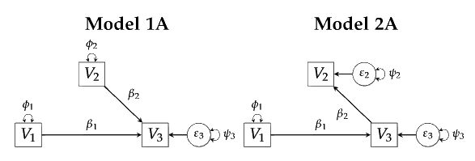
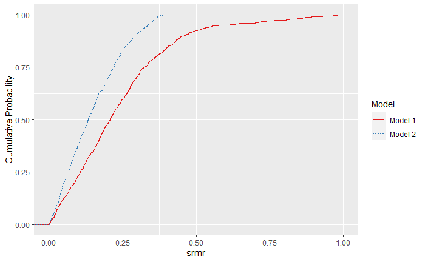

<!-- README.md is generated from README.Rmd. Please edit that file -->

```{r, echo = FALSE}
knitr::opts_chunk$set(
  collapse = TRUE,
  comment = "#>"
)
```

# ockhamSEM

## Overview

ockhamSEM is an R package for studying the fit propensity of single-group structural equation models with continuous items. Underlying support is through the [lavaan](https://lavaan.ugent.be/) package. A variety built-in graphical and text summaries are provided.

The package is introduced in Falk and Muthukrishna (2020) Parsimony in Model Selection: Tools for Assessing Fit Propensity.

## Installation

```{r, eval = FALSE}
# From GitHub:
# install.packages("devtools")
devtools::install_github("falkcarl/ockhamSEM")
```

## Usage

Let's compare fit propensity for the following two models consisting of 3 variables:



### 1. Set up a covariance matrix to fit models to:

```{r, eval = FALSE}
p<-3 # number of variables
temp_mat <- diag(p) # identity matrix
colnames(temp_mat) <- rownames(temp_mat) <- paste0("V", seq(1, p))
```

### 2. Define and fit the two models to be compared using the lavaan package:

```{r, eval = FALSE}
mod1a <- 'V3 ~ V1 + V2
  V1 ~~ 0*V2'
mod2a <- 'V3 ~ V1
  V2 ~ V3'

mod1a.fit <- sem(mod1a, sample.cov=temp_mat, sample.nobs=500)
mod2a.fit <- sem(mod2a, sample.cov=temp_mat, sample.nobs=500)
```

### 3. Run fit propensity analysis

Here we use the onion method to generate random correlation matrices and will compare fit propensity for the SRMR and CFI fit measures.

```{r, eval = FALSE}
res <- run.fitprop(mod1a.fit, mod2a.fit, fit.measure=c("srmr","cfi"),
  rmethod="onion",reps=1000)
```
Output:
```
[1] "Generate matrices"
[1] "Fitting models"
```

### 4. Summarize and plot fit propensity

Summarize:

```{r, eval = FALSE}
summary(res)
```

Output:
```
Quantiles for each model and fit measure:

 Model  1 
       srmr   cfi
0%    0.001 0.000
10%   0.041 0.227
20%   0.091 0.413
30%   0.133 0.574
40%   0.177 0.682
50%   0.219 0.778
60%   0.269 0.852
70%   0.316 0.922
80%   0.406 0.969
90%   0.635 0.994
100% 11.059 1.000

 Model  2 
      srmr   cfi
0%   0.000 0.000
10%  0.031 0.129
20%  0.051 0.257
30%  0.079 0.394
40%  0.104 0.522
50%  0.133 0.656
60%  0.162 0.763
70%  0.202 0.870
80%  0.239 0.936
90%  0.294 0.982
100% 0.400 1.000

 Information about replications for each model and fit measure:

 Model  1 

Mean across replications
 srmr   cfi 
0.366 0.693 

Median across replications
 srmr   cfi 
0.219 0.778 

Number of finite values
srmr  cfi 
 999  999 

Number of NA values
srmr  cfi 
   1    1 

 Model  2 

Mean across replications
 srmr   cfi 
0.148 0.601 

Median across replications
 srmr   cfi 
0.133 0.656 

Number of finite values
srmr  cfi 
1000 1000 

Number of NA values
srmr  cfi 
   0    0 

 Effect Sizes for Differences in Model Fit:

  srmr 

 Model 1 vs. Model 2 
   Cohen's d:           -2.386 
   Cliff's delta:       0.342 
   Komolgorov Smirnov:  0.273 

  cfi 
p-value will be approximate in the presence of ties
 Model 1 vs. Model 2 
   Cohen's d:           -2.057 
   Cliff's delta:       0.168 
   Komolgorov Smirnov:  0.145 
```

Plot:

```{r, eval = FALSE}
plot(res)
```

Output:




